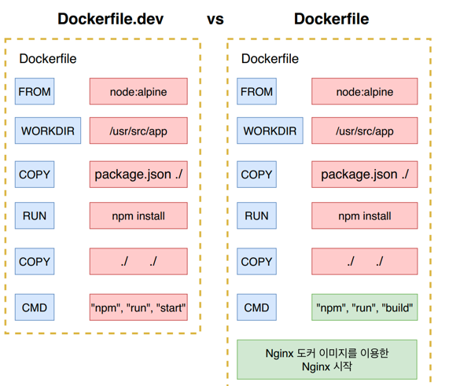

# docker-ci-inf
인프런 John Ahn님의 따라하며 배우는 도커와 CI환경을 공부하면서 정리한 Repo입니다.

# 도커를 쓰는 이유

* 어떠한 프로그램을 다운 받는 과정을 굉장히 간단하게 `만들기 위해서`!

* 서버, 패키지버전, 운영체제 등에 따라 프로그램 설치 과정중 많은 에러들이 발생

* 도커를 사용하면 에러도 덜 발생하고 설치 과정도 매우 간단해진다.

# 도커란 무엇인가

* 컨테이너를 사용하여 응용프로그램을 더 쉽게 만들고 배포하고 실행할 수 있도록 설계된 도구.

* 컨테이너 기반의 오픈소스 가상화 플랫폼이며 생태계

* ## 서버에서의 컨테이너 개념
    * 컨테이너 안에 다양한 프로그램, 실행환경을 컨테이너로 추상화하고 동일한 인터페이스 제공
    * 프로그램의 배포 및 관리를 단순하게 만듬
    * 프로그램을 손쉽게 이동, 배포, 관리를 할 수 있게 해줌
    * AWS, Azure, GCP 등 어디든 실행가능하게 해줌
        * MySQL, Node, Webpack 등

# 도커이미지와 도커 컨테이너 정의

## 컨테이너
> 코드와 모든 종속성을 패키지화 하여 응용프로그램이 한 컴퓨팅 환경에서 다른 컴퓨팅 환경으로 빠르고 안정적으로 실행되도록하는 소프트웨어의 표준 단위

* 간단하고 편리하게 프로그램을 실행시켜주는것
* `도커 이미지`

## 컨테이너 이미지

> 코드, 런타임, 도구, 라이브러리 및 설정과 같은 응용프로그램을 실행하는데 필요한 모든것을 포함하는, 가볍고 독립적이며 실행가능한 `소프트웨어 패키지`

* 컨테이너 이미지는 런타임에 컨테이너가 되고, 도커 컨테이너의 경우 도커 엔진에서 실행될 때 이미지가 컨테이너가 된다.

* 리눅스나 윈도우 기반 App 모두에서 사용할 수 있는 컨테이너화 된 소프트웨어는 인프라에 관계없이 항상 동일하게 실행

* 컨테이너는 SW를 환경으로부터 격리시키고 개발과 스테이징의 차이에도 불구하고 균일하게 작동하도록 보장

* `도커이미지의 인스턴스`

> 도커 이미지는 프로그램을 실행하는데 필요한 설정이나 종속성을 갖고 있으며,  
도커 이미지를 이용해서 컨테이너를 생성!,  
도커 컨테이너를 이용하여 프로그램을 실행!


# Mac Os에서의 도커 설치

1. Docker사이트로 이동 - Docker.com
2. get started 버튼 클릭
3. 도커 다운로드
4. 설치
5. 회원가입
6. 로그인
7. 도커설치 확인
8. 명령어 docker version

# 도커 사용할때의 흐름

* 명령어 docker run [이미지 이름]

## 명령어를 사용했을때의 흐름
1. 명령어를 치면
2. 도커 클라이언트(명령어를 입력한 컴퓨터)에서 도커 서버로 명령어 전달. 
3. 도커 이미지 보관 장소에서 이미지가 있는지 확인 
  * 없으면 unable to find image라고 나옴
4. 없다면 도커 허브에서 이미지들을 가져온다.
  * pulling from library/이미지명 라고 나옴

  *  

  
* 정리하자면
  1. 도커 CLI에 커맨드 입력
  2. 도커 서버(도커 Daemon)이 명령어(커맨드)를 받아 그것에 따라 작업한다.

# 도커와 가상화 기술과의 차이를 통한 컨테이너 이해

* 하이퍼바이저 기반의 가상화
> 논리적으로 공간을 분할하여 VM이라는 독립적 가상 환경의 서버  
> 호스트 시스템에서 다수의 게스트 OS를 구동할 수 있게하는 소프트웨어, 하드웨어를 가상화 


* 

* 도커가 VM과 비교했을 때는 컨테이너가 하이퍼바이저와 게스트 OS가 필요하지 않으므로 더 가벼움

* 어플리케이션 실행 시 컨테이너 방식에서는 호스트 OS 위에 실행 패키지인 이미지만 배포하면 된다  

* ## 공통점
  * 도커 컨테이너와 가상 머신은 기본 하드웨어에서 격리된 환경 내에 어플리케이션을 배치하는 방법

* ## 차이점
  * 격리된 환경을 얼마나 격리시키는지의 차이


* 도커 컨테이너에서 돌아가는 애플리케이션은 컨테이너가 제공하는 격리 기능 내부에 샌드박스가 있지만, 같은 호스트(OS등)의 다른 컨테이너와 `동일한 커널 을 공유`한다.
* 그래서 컨테이너 내부에서 실행되는 프로세스는 호스트 시스템에서 볼 수 있다.
* 예를 들어 도커와 함께 몽고DB 컨테이너를 시작하면 호스트OS(실행 호스트, 도커 아님, 나같은경우 맥)의 일반 쉘에서 `ps-e grep 몽고`를 실행하면 프로세스가 표시된다
* 또한 컨테이너가 전체 OS를 내장할 필요가 없으므로 매우 가볍고 5~100MB밖에 안된다.


## 도커 컨테이너 격리 방법

* Cgroup(control groups)와 네임스페이스에 대해 알아야한다.
* 다른 프로세스 사이에 벽을 만드는 리눅스 커널 기능들

* C Group(controler groups)
  * CPU, 메모리, Network Bandwith, HD I/O등 프로세스 그룹의 시스템 리소스 사용량 관리 
  * 어떤 앱이 사용량이 너무 많다면 그 앱을 Cgroup에 집어 넣어 CPU와 같은 메모리 사용 제한 가능

* 네임스페이스
  * 하나의 시스템에서 프로세스를 격리시킬 수 있는 가상화 기술
  * 별개의 독립된 공간을 사용하는 것처럼 격리된 환경을 제공하는 경량 프로세스 가상화 기술 


# 이미지로 컨테이너 만들기

* 이미지는 응용프로그램을 실행하는 필요한 모든 것을 포함
  * 컨테이너 시작 명령어
  * 파일 스냅샷(응용프로그램의 스냅샷, 디렉토리나 파일을 카피한 것)

## 이미지로 컨테이너 만드는 순서

1. Docker 클라이언트에 docker run [이미지] 명령어 입력
2. 도커 이미지에 있는 파일 스냅샷을 컨테이너 하드 디스크에 옮ㅇ


## 컨테이너들 나열하기

* ### docker ps 명령어

* CONTAINER ID : 컨테이너 고유한 아이디(해쉬값). 실제로는 더욱 길지만 일부분만 표출.
* IMAGE : 컨테이너 생성시 사용한 도커 이미지명
* COMMAND : 컨테이너 시작시 실행될 명령어. 대부분 이미지에 내장되어 있으므로 별도 설정이 필요 X
* CREATED: 컨테이너 생성된 시간
* STATUS : 컨테이너 상태. 
  * 실행중 : Up
  * 종료 : Exited
  * 일시정지 : Pause.

* PORTS : 컨테이너가 개방한 포트와 호스트에 연결한 포트. 특별한 설정을 하지 않은 경우 출력되지 않는다.
* NAMES : 컨테이너의 고유 이름.
  * 컨테이너 생성시 --name 옵션으로 이름 설정 가능. 설정하지 않으면 임의로 설정 
  * docker rename [원래컨테이너이름] [바꿀컨테이너이름] 으로 변경 가능 

## 실행되지 않은 컨테이너 포함한 모든 컨테이너 나열 명령어
* docker ps -a

# 도커 컨테이너의 생명주기 

* 
  * docker run = docker create + docker start (-a옵션)

* 
  * docker stop : 정리하는 시간을 주고 킬 (Grace Period)
  * docker kill : 정리하는 시간 없이 바로 멈추기 

* 
  * 중지된 컨테이너 삭제 : docker rm <아이디> 
  * 모든 컨테이너 삭제 : docker rm ``docker ps -a -q``
  * 도커 이미지 삭제 docker rmi <이미지id>
  * 한번에 사용하지 않는 컨테이너, 이미지, 네트워크 모두 삭제 : docker system prune


## 이미 실행중인 컨테이너에 명령어 전달?
* docker exec <컨테이너 아이디>

### docker run vs docker exec
1. docker run은 새로운 컨테이너 만들어서 실행
2. docker exec는 이미 실행중인 컨테이너에 명령어 전달 
  * ex: docker exec <컨테이너아이디> ls 
  * docker run <이미지이름> ls

# 레디스를 이용한 컨테이너 이해

* 

* 먼저 레디스 서버를 실행한 후, 클라이언트를 통해 명령어를 전달해줘야 한다.

1. 먼저 레디스 서버 작동. docker run redis
2. 그 후 다른 터미널로 레디스 클라이언트 작동. redis-cli
* 이러면 에러가 난다. 레디스 클라이언트에서 도커 컨테이너[레디스 서버 동작중인] 접근 불가.(컨테이너 밖이라)
* 해결방법 : 같은 컨테이너 안에서 레디스 클라이언트(redis-cli)를 실행하면된다

3. docker exec -it <컨테이너아이디> redis-cli
  * -i : interactive 
  * -t : terminal
  * it 명령어를 안붙이면 터미널에서 나와진다.  

## 실행중인 컨테이너에 쉘 환경으로 접속
* docker exec -it <컨테이너아이디> sh
* 쉘에서 나오려면 컨트롤 + D 

# 직접 도커 이미지 만들기

* 

* 도커 이미지는 Dockerhub에 다른 사람들이 만들어 놓은 것을 이용할 수도 있고, 직접 도커 이미지를 만들어서 사용하거나 도커 허브에 업로드 할 수 있다.


# 도커 파일 만들기 

* 도커 파일이란? 
  * 도커 이미지를 만들기 위한 설정 파일. 컨테이너가 어떻게 행동해야 하는지에 대한 설정들을 정의해 주는곳 

## 도커 파일 만드는 순서 (도커 이미지가 필요한 것이 무엇인지를 생각)

1. 베이스 이미지를 명시해준다. (파일 스냅샷에 해당)
2. 추가적으로 필요한 파일을 다운 받기 위한 몇가지 명령어를 명시해준다.(파일 스냅샷에 해당)
3. 컨테이너 시작시 실행 될 명령어를 명시해준다.(시작시 실행 될 명령어에 해당)

* 도커 파일 이미지 이름 지정
* docker build -t imagename:0.0
* -t 옵션 

### 베이스 이미지

* 

* ### 예제 : Hello문구 출력하는 도커 이미지 만들기
1. 도커 파일을 만들 폴더 하나 만들기 ex) dockerfile-folder
2. 방금 생성한 도커 파일 폴더를 에디터를 이용해서 실행(vscode 추천)
3. 파일 하나를 생성, 이름은 dockerfile(확장자 없음)
4. 그안에 먼저 어떻게 진행해 나갈지 기본적인 토대를 명시 

5. 베이스 이미지부터 실제 값으로 추가해주기
6. 베이스 이미지는 ubuntu나 centos 등을 써도 되지만 hello출력 기능은 굳이 사이즈가 큰 베이스 이미지를 쓸 필요가 없기에 사이즈가 작은 alpine 베이스 이미지 사용 
7. 컨테이너 시작시 실행될 명령어를 넣어준다.

```docker
# 베이스 이미지 명시
# FROM baseImage
FROM alpine

# 추가적으로 필요한 파일 다운로드
# RUN command


# 컨테이너 시작시 실행될 명령어 명시
# CMD [ "executable" ]
CMD [ "echo", "hello"]
```

* #### 도커파일 명령어
  * FROM : 이미지 생성시 기반이 되는 이미지 레이어 
    * <이미지이름>:<태그> 형식으로 작성
    * 태그를 안붙이면 자동적으로 가장 최신것으로 다운로드. ex) ubuntu:14.04
  * RUN : 도커 이미지가 생성되기 전에 수행할 쉘 명령어
  * CMD : 컨테이너가 시작되었을 떄 실행할 실행 파일 또는 셸 스크립트. 
    * 이 명령어는 Dockerfile내 1회만 쓸 수 있따.  


# 도커파일로 도커 이미지 만들기 

* 

* 도커 파일에 입력된 것들이 도커 클라이언트에 전달되어서 도커 서버가 인식하게 하여야 한다
* 명령어 : docker build ./ 또는 docker build .

* 

* 도커 이미지에 이름주기 
* docker build -t [youngsoo/hello:latest] .
  * 옵션 [-t 나의도커아이디 / 저장소or프로젝트 이름 : 버전 ] 


# 도커를 이용해서 Node.js 어플 만들기
#### https://nodejs.org/fr/docs/guides/nodejs-docker-webapp/

# 생성한 이미지로 어플리케이션 접근이 안되는 이유(포트 맵핑)


* docker run 이미지 이름 
* 에서 다음과 같이 실행한다
* docker run -p 49160:8080 이미지이름 
  * 49160 등 내부 포트는 아무거나 줘도 된다 ( 안쓰는것)
  * 그럼 외부에서 49160 등 앞 포트로 접속하면 된다. 
  * localhost:49160


* 

# 워크디렉토리 (Working Directory)

* 도커 이미지 안에서 어플리케이션 소스 코드를 갖고 있을 디렉토리를 생성하는 것 

* 현재 만들어놓은 이미지의 Root 디렉토리 보는법
  * docker run -it <이미지이름> 명령어


```shell
FROM node:16

# create app directory
WORKDIR /usr/src/app

# 도커 컨테이너 안에 저장
COPY package.json ./
```
* 
* 

* 워크 디렉토리를 지정하게 되면, 루트부터 접근하는게 아닌 워크 디렉토리부터 접근하게된다
  *  따라서 명령어도 워크 디렉토리 기반에서부터 시작한다. 

* 워크 디렉토리를 지정하지 않고 그냥 copy할때의 문제점
  * 베이스 이미지에 home이라는 폴더가 있을 시, 새로 추가되는 폴더 이름이 home이라면 중복되서 그냥 덮어씌어져 버린다.
    * 원래 파일 시스템의 중요한 파일과 이름이 같으면 중요한 원래 파일이 날라간다.  
  * 모든 파일이 한 디렉토리에 들어가버리니 정리정돈이 안된다.
  * 예를들어 루트에 다 파일이 몰릴수도 있다.

# 도커 이미지 삭제

* 현재 이미지 확인 : docker images
* 이미지 삭제 : docker rmi [이미지id]
* 컨테이너 삭제 전 이미지 삭제 : docker rmi -f [이미지id]

## 컨테이너 삭제

* 동작중인 컨테이너 확인 : docker ps
* 정지된 컨테이너 확인 : docker ps -a
* 컨테이너 삭제 : docker rm [컨테이너 id]
* 삭제된 것 확인 : docker ps -a
* 복수개 삭제 : docker rm [id1], [id2]
* 컨테이너 모두 삭제 : docker rm `docker ps -a -q`

# 어플리케이션 소스 변경으로 다시 빌드하는법

어플 실행 순서
* 도커파일작성 -> 빌드 -> 도커파일로 이미지 생성 -> run -> 컨테이너 생성후 앱 실행


* 소스코드를 계속 변경시켜 변경 된 부분을 어플리케이션에 반영시킬라면 
  * 이미지 생성부터 다시 실행시켜줘야한다. 

* 그런데 이런식으로 하면 너무 비효율적이다. 
* 그럼 어떻게? 

* 

* npm install 할 때 불 필요한 다운로드를 피하기 위해서 이렇게 한다
* 원래 모듈을 다시 받는 것은 모듈에 변화가 생겨야만 다시 받아야 하는데, 소스코드에 조금의 변화만 생겨도 모듈 전체를 다시 받는 문제점이 있다.
> `그러므로 RUN npm install 전 단계에서 COPY 할 때는 오직 module에 관한것만 해주고,  
>  RUN npm install 이후에 다시 모든 파일을 COPY 해준다. 

```shell
FROM node:16

# create app directory
WORKDIR /usr/src/app

# 도커 컨테이너 안에 저장
COPY package.json ./

RUN npm install

# Bundle app source
COPY ./ ./

CMD ["node", "server.js"]
```

# Docker Volume에 대하여 

* 소스를 변경할 때 마다 변경된 소스 부분은 COPY한 후 이미지를 다시 빌드를 해주고 컨테이너를 다시 실행해줘야 변경된 소스가 반영이 된다 
* 이러한 작업은 시간 소요가 크며 이미지도 너무 많이 빌드하기 때문에 VOLUME을 사용한다.
* 

## Volume 사용해서 어플리케이션 실행하는법
* 

* 이렇게 volume을 이용해서 키면 빌드할 때 소스를 바꾸더라도 바꾼 코드가 적용이 된다
* docker run -p 5000:8080 -v /usr/src/app/node_modules -v $(pwd):/usr/src/app <이미지이름>
  * /usr/src/app 이건 dockerfiled의 workdir

* 이러면, 도커 이미지를 빌드하지 않고 run만 해도 바꾼 코드가 적용이 된다. 


# 도커 compose

* docker compose는 다중 컨테이너 도커 애플리케이션을 정의하고 실행하기 위한 도구 

* 실행 명령어 : docker-compose up 

### Redis
* 메모리 기반의 키-값구조. 모든 데이터를 메모리에 저장해서 빠르게 조회할 수 있는 비관계형 데이터베이스

* 레디스 사용 이유
  * 메모리에 저장하기 때문에 MySQL 같은 데이터베이스에 데이터를 저장하는 것과 데이터를 불러올 때 훨신 빠르게 처리 
  * 영속적으로도 보관 가능 그래서 재부팅해도 데이터 유지. 

* 노드에서 레디스 사용법
  * redis-server를 작동시켜줘야한다.
  * createClient()함수를 이용해서 클라이언트생성
  * redis server가 작동하는 곳과 Node.js앱이 작동하는 곳이 다른 곳이라면 host인자와 port인자를 명시해주어야한다.
```javascript
const client = redis.createClient({
  host: "https://redis-server.com",
  port:6379
});
```

* 레디스의 기본 포트 6379

### 도커 환경에서 레디스 클라이언트 생성시 주의사항 

* 도커 Compose를 사용할때는 host옵션을 docker-compose.yml 파일에 명시한 컨테이너 이름으로 주면 된다.

* 서로 다른 컨테이너 사이에 통신하려면 다른 방법을 써야한다.
  * 멀티 컨테이너 상황에서 네트워크를 연결 시켜주기 위해선 docker compose를 사용해야한다. 
* 

* 이슈 : https://stackoverflow.com/questions/58854488/nodejs-redis-createclient-function?rq=1

* docker-compose up -d 옵션을 주면 백그라운드로 실행 

* 도커 컴포즈를 통해 작동시킨 컨테이너들을 한꺼번에 중단 시키려면 
  * docker compose down 
  * docker-compose.yml 있는 디렉토리에서 명령어를 실행 해야 한다. 

# 개발환경과 운영환경 에서의 도커파일

* 개발환경에서는 Dockerfile.dev
* 운영환경에서는 Dockerfile

* docker build -f Dockerfile.dev ./
  * -f : 이미지를 빌드할 때 쓰일 도커 파일을 임의로 지정해준다  

* 도커 환경에서 실행할 때는 로컬환경에서의 node_modules를 지워주는게 좋다 . 

* docker run -it -p 3000:3000 이미지 이름


# Volume 사용해서 리액트 or 도커 어플리케이션 실행하는법

* docker run -p 3000:3000
* -v /usr/src/app/node_modules
  * 호스트 디렉토리에 node_modules는 없기에 컨테이너에 맵핑 하지 말라
* -v $(pwd):/usr/src/app
  * pwd 경로에 있는 디렉토리 혹은 파일을 /usr/src/app 경로에서 참조 
* <이미지 아이디>  

> docker run -p 3000:3000 -v /usr/src/app/node_modules -v $(pwd):/usr/src/app <이미지 아이디>  
  * 이러면 변경시 바로 적용된다.


# Docker Compose로 좀 더 간단하게 앱 실행 

* 

* docker-compose up

# 테스트 코드도 자동 반영하는법

* test를 위한 컨테이너를 compose 파일에 하나 더 만들어주고 volume을 이용하면 된다.

# 운영환경을 위한 nginx

* 

* 왜 개발환경 서버와 운영환경 서버를 다른걸 써야하나?
   * >개발에서 사용하는 서버는 소스를 변경하면 자동으로 전체 앱을 다시 빌드해서 변경 소스를 반영해주는 것 같이 개발환경에 특화된 기능들이 있기에 그러한 기능이 없는 nginx 서버보다 더욱 적합하다.    
     그리고 운영환경에서는 소스를 변경할 때 다시 반영해 줄 필요가 없으며 개발에 필요한 기능들이 필요하지 않기에 더 깔끔하고 빠른 nginx를 웹 서버로 사용한다. 

* 개발환경 도커 파일과 운영환경 도커 파일 비교
* 

* Dockerfile
* 

* FROM as절 : 이 FROM 절부터 다음 FROM절 까지는 모두 builder stage라는것을 명시 

* --from=builder : 다른 stagedㅔ 있는 파일을 복사할때 다른 stage 이름을 명시
* /usr/src/app/build /usr/share/nginx/html 
  * builder stage에서 생성된 파일들은 /usr/src/app/build에 들어가게 되며 그곳에 저장된 파일들을 /usr/share/nginx/html로 복사를 시켜줘서 nginx가 웹 브라우저의 http 요청이 올 때 마다 알맞은 파일을 전해줄 수 있게 만든다.

* /usr/share/nginx/html : 이 장소로 build파일을 복사시킨다. 이 장소로 파일을 넣어두면 nginx가 알아서 client에서 요청이 들어올 때 알맞은 정적 파일들을 제공해준다.
  * 이 장소는 설정을 통해서 바꿀 수 있다.

* 큰 박스 두개를 위 아래로 설정하면, 
1. 빌드 파일 생성(Builder Stage)
2. nginx 가동하고 빌드폴더의 파일들을 웹 브라우저로 보여준다 .

* 다음 작성된 Dockerfile로 이미지 생성
   * docker build .

* 이미지를 생성했다면 그 이미지를 이용해서 앱 실행
  * docker run -p 8080:80 이미지 이름
  * nginx의 기본 포트는 80 


# 실제로 배포해보기 (테스트 & 배포)

* 
* 소스코드 test 성공시 aws에 배포 

## Travis CI

* https://travis-ci.org/ 에서 https://travis-ci.com 로 변경 

* Travis CI는 Github에서 진행되는 오픈소스 프로젝트를 위한 지속적인
  통합(Continuous Integration) 서비스이다. 2011년에 설립되어
  2012년에 급성장하였으며 Ruby언어만 지원하였지만 현재 대부분의 개발
  언어를 지원하고 있다. Travis CI를 이용하면 Github repository에 있
  는 프로젝트를 특정 이벤트에 따라 자동으로 테스트, 빌드하거나 배포할 수
  있다. Private repository는 유료로 일정 금액을 지불하고 사용할 수 있
  다.

### Travis CI 흐름
* 로컬 git -> github -> travis ci -> aws 

1. 로컬 git에 있는 소스를 github (remote)저장소에 push
2. github master 저장소에 소스가 push되면 travis ci에게 소스가 push 되었다고 이야기
3. travis ci는 업데이트된 소스를 github에서 가지고옴
4. 깃헙에서 가져온 소스의 테스트 코드 실행
5. 테스트 성공시 호스팅 사이트로 보내서 배포 


* travis.yml 파일 작성
* 

```yaml
sudo: required

language: generic

services:
  - docker

before_install:
  - echo "start creating an image with dockerfile"
  - docker build -t kim206gh/docker-react-app -f Dockerfile.dev .
  
script:
  - docker run -e CI=true kim206gh/docker-react-app npm run test -- --coverage

after_success:
  - echo "Test success"

```

* sudo : 관리자 권한
* language : 언어(플랫폼)
* services : 도커 환경 구성
* before_install : 스크립트 실행전
* script : 실행할 스크립트
* after_success : 테스트 성공후 할 일 

# AWS

* 

* Elastic Beanstalk 사용

1. CreateApplication 클릭
2. 어플리케이션 이름 정하기
3. 플랫폼 선택
4. 생성
5. 앱 생성 후 배포

## aws elastic beanstalk 배포를 위한 travis 소스코드

```yaml
sudo: required

language: generic

services:
  - docker

before_install:
  - echo "start creating an image with dockerfile"
  - docker build -t kim206gh/docker-react-app -f Dockerfile.dev .
  
script:
  - docker run -e CI=true kim206gh/docker-react-app npm run test -- --coverage

after_success:
  - echo "Test success"

deploy:
  provider: elasticbeanstalk
  region: "us-east-2"
  app: "docker-react-app"
  env: "Dockerreactapp-env"
  bucket_name: "elasticbeanstalk-us-east-2-064875866284"
  bucket_path: "docker-react-app"
  on:
    branch: master
  access_key_id: AWS_ACCESS_KEY
  secret_access_key : AWS_SECRET_ACCESS_KEY
```

* 공백 맞춤 주의!!

* 

* travis ci의 aws 접근을 위한 api 생성
* github -> travis ci -> aws
  * aws 에서 제공해주는 secret key를 travis yml 파일에다가 적어준다.  

* 

* aws iam 권한 변경
> AdministratorAccess-AWSElasticBeanstalk로 선택하시면 될 것 같아요!
AWS 도큐먼트 보시면 'Previously, Elastic Beanstalk supported two other managed user policies, AWSElasticBeanstalkFullAccess and AWSElasticBeanstalkReadOnlyAccess. We plan on retiring these previous policies.' 라고 하면서 밑에 새로운 정책을 제시하고 있어요!
링크 남깁니다~ https://docs.aws.amazon.com/elasticbeanstalk/latest/dg/AWSHowTo.iam.managed-policies.html


* ## <Travis CI>Skipping a deployment with the s3 provider because this branch is not permitted 에러
* <Travis CI>Skipping a deployment with the s3 provider because this branch is not permitted

# 다중 도커 환경 in AWS (다중 도커 컨테이너)
* Docker 컨테이너 세트를 Elastic Beanstalk 애플리케이션으로 배포하는 방법을 설명하는 Elastic Beanstalk 고유의 JSON 파일
* Dockerrun.aws.json 을 멀티 컨테이너 Docker 환경에 사용 가능
  * 이 파일로 어떻게 다중 컨테이너를 작동 시킬지 Elastic Beanstalk에 알려주는것 
  * 
    * Task에다가 어떻게 컨테이너를 실행할지를 정의해준다.
      * Task Definition(작업 정의)
    * 그리고 작업 정의를 등록할 때는 Container Definition을 명시해 줘야한다 

* AWS에서 말하는 Task Definition(작업정의)에서 지정할 수 있는 것들. 
  * 작업의 각 컨테이너에 사용할 도커 이미지
  * 각 작업 또는 작업 내 각 컨테이너에서 사용할 CPU 및 메모리의 양
  * 사용할 시작 유형으로서 해당 작업이 호스팅되는 인프라를 결정
  * 작업의 컨테이너에 사용할 도커 네트워킹 모드
  * 작업에 사용할 로깅 구성
  * 컨테이너가 종료 또는 실패하더라도 작업이 계속 실행될지 여부
  * 컨테이너 시작 시 컨테이너가 실행할 명령
  * 작업의 컨테이너에서 사용할 데이터 볼륨
  * 작업에서 사용해야 하는 IAM 역할 

* 이 작업 정의를 등록하려면 Container Definition을 명시해줘야한다
  * dockerrun.aws.json에 명시  

##  Dockerrun.aws.json 작성하는법

* 

## 다중 컨테이너 앱을 위한 EB 환경 생성

* 

## VPC(virtual private cloud)와 security group 설정하기 

* 인스턴스와 RDS를 연결하기 위해 

## VPC란
* VPC를 사용하면 AWS 클라우드에서 논리적으로 격리된 공간을 프로비저닝하여 고객이 정의하는 가상 네트워크에서 AWS 리소스를 시작할 수 있따.
* 간단하게, EC2 인스턴스나 EB 인스턴스 혹은 RDS를 나의 아이디에서만 접근이 가능하게 격리된 네트워크에서 생성이 되게 해준다
* 그러기에 다른 아이디로는 접근 하는것은 물론 보는것도 불가능해진다. 

## Security group

* inbound 트래픽 : 외부에서 ec2 인스턴스나 eb 인스턴스로 요청을 보내는 트래픽 .http, https, ssh
* outbound 트래픽 : ec2인스턴스나 eb인스턴스에서 외부로 나가는 트래픽, 파일 다운로드, 트래픽 응답하는 경우도 포함 


## VPC와 Security group을 통해 인스턴스와 rds가 통신하는법
* 같은 vpc 안에 있는 aws 서비스 간에는 트래픽을 모두 허용할 수 있게 security group을 허용해준다. 
